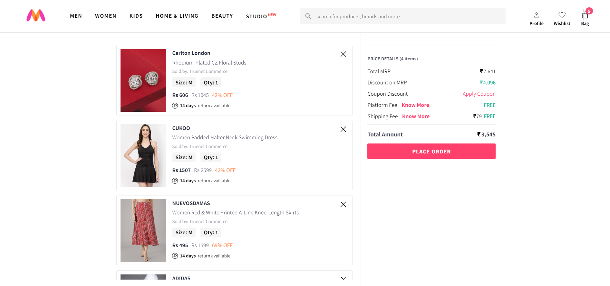

# Myntra Clone Website


Myntra is a fully responsive ecommerce website, responsive in all mobile devices, built using HTML, CSS, and JavaScript.

## Demo




To get **MyntraClone**, use cammand:

```bash
sudo git clone https://github.com/VishnuPratapGit/MyntraClone.git
```
